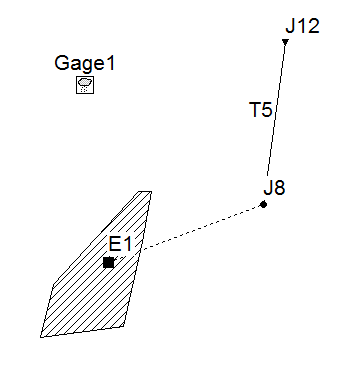
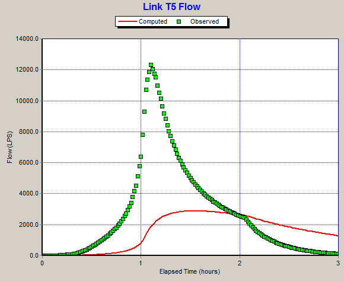
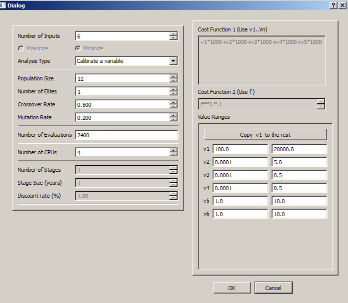
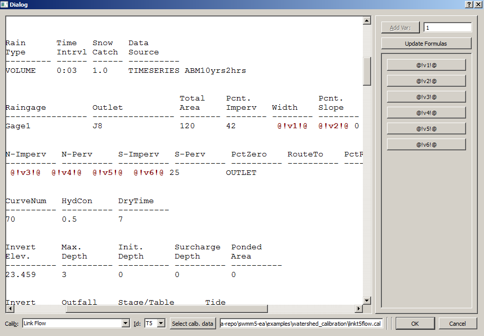
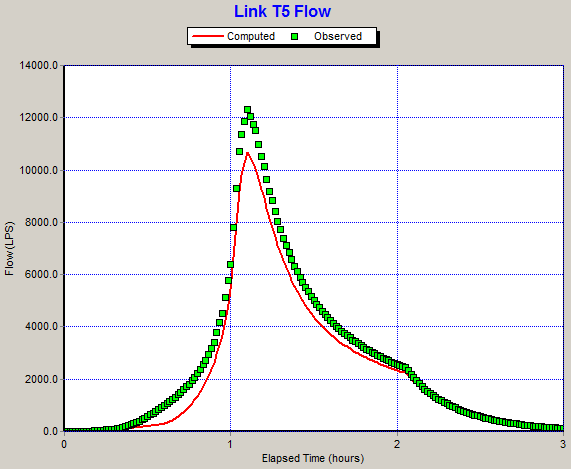
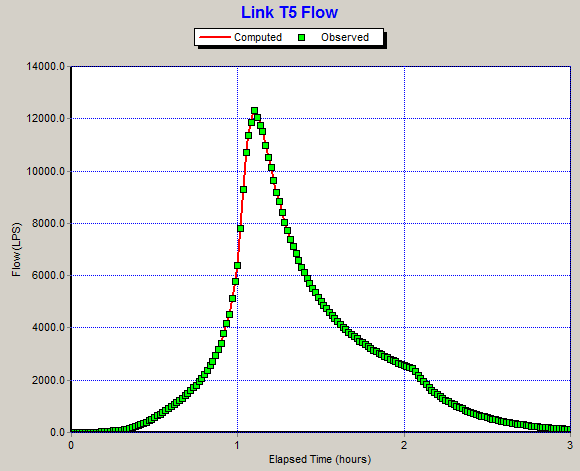

Example 2: Calibration of Networks
==================================

   
   Network for calibration example. 

This example demonstrates the use of SWMM5-EA in calibration of drainage networks. The simple network shown in the above figure consists of a single watershed connected to an open rectangular channel of 3 m (width) x 1 m (maximum depth) size, flowing into a free outfall. Measured data for the flow time series in the channel is available (below).

   
   The original network file. Measured flow data shown in green squares.  Red line is the flow hydrograph before calibration. 

In this example we vary the six parameters. 

======================= ============================== =====================
Parameter                Range                          Variable used
======================= ============================== =====================
Width of overland flow   ``100 m`` -- ``20000 m``          v1
Avg. slope (watershed)  ``0.0001 %``    -- ``5.0 %``       v2
Mannings n 
   Impervious            ``0.0001`` -- ``0.5``             v3
   Pervious              ``0.0001`` -- ``0.5``             v4
Detention Storage 
   Impervious            ``1 mm`` -- ``10 mm``             v5
   Pervious              ``1 mm`` -- ``10 mm``             v6
      
======================= ============================== =====================

They are represented in the Project as follows:

   

   
   Project parameters used.
   

   
   Place Holders in SWMM5 input file.

Following figures show the calibration results at first generation and after 100 generations. 
 
   

   
   The network file corresponding to the best solution at first generation.
   

   
   The network file corresponding to the best solution after 100 generations.