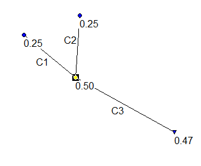
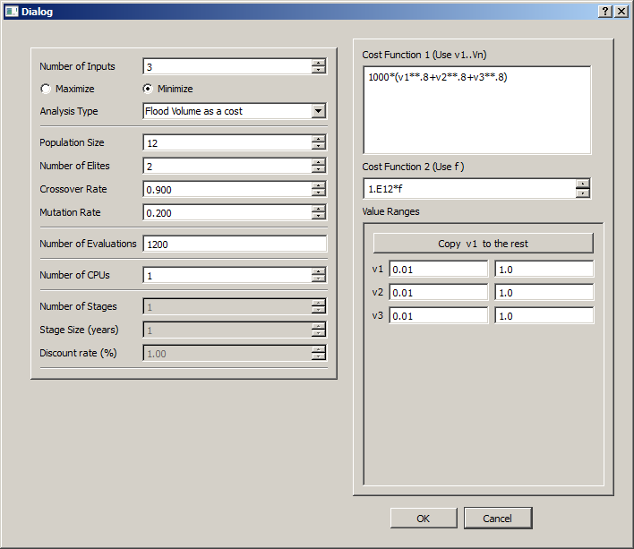
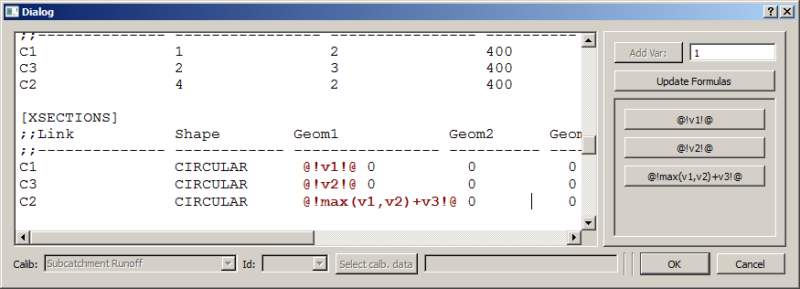
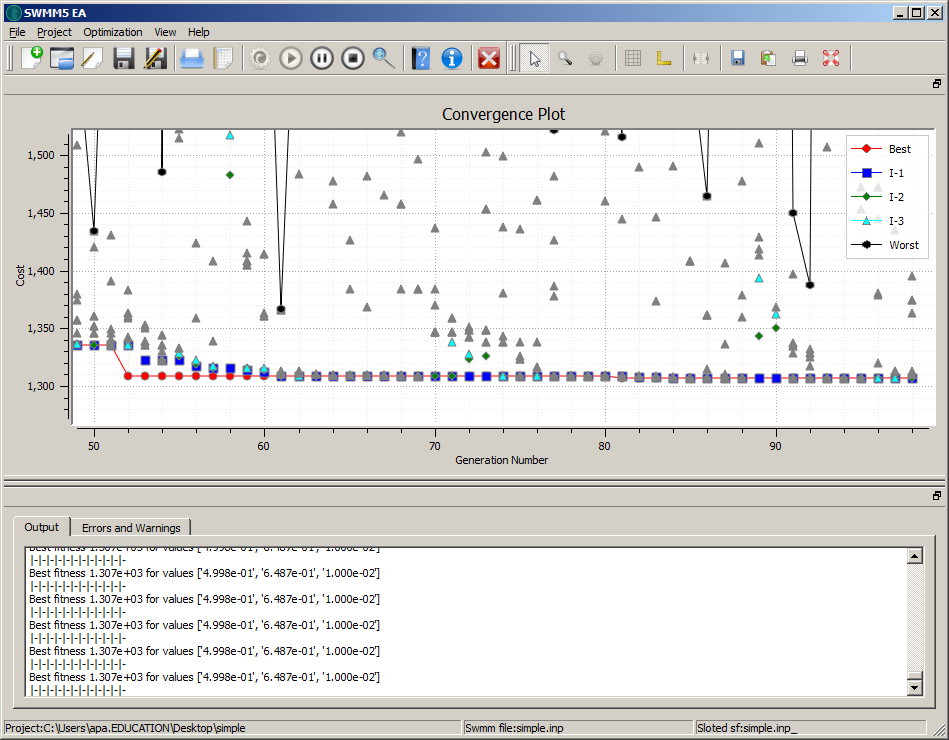
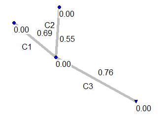

Quick Start
============
This section provides a quick walk-through a simple example that will help you to start using SWMM5-EA. 

SWMM5 Network
-------------
There is a simple SWMM5 network named ``simple.inp`` 
that we use for this walk-through. It consists of three conduits 
(see figure below) three junctions and a free outfall.  

   
   SWMM5 network ``simple.inp``
	 
  

The two upstream nodes have a (constant) inflow of :math:`m^3/s`. 

Optimization problem
--------------------
The objective is to find the least cost design, that does not cause flooding in the network. The total cost of building with circular conduits used in the network are given by

.. math::

        c=1000*(D**0.8)

In drainage system design it is customary to have downstream conduits at least as large as any of the upstream nodes. So, in this example we have to maintain the following constraint: 

.. math::
        
       D_{C3}\geq \mbox{max}(D_{C1},D_{C2})

	   
Where :math:`D_{Cn}` is the diameter of conduit :math:`Cn`. 

Steps
-----

 #. Create a new project (Project > New Project)
 #. Save the Project in some directory ( Project > Save As, In the dialog select an empty direcotory)
 #. Load the SWMM network file to this project (File > Load SWMM file, Navigate to the simple sub-directory in examples directory (in windows this is typically ``<program files>\\SWMM5-EA\\examples\\simple``) and select ``simple.inp`` file. SWMM5-EA will copy the file to your project directory and load it.)
 #. Edit the project parameters ( Project > Edit ) and make sure the values in the dialog as same as the ones shown in the figure below. Click OK.
 #. Open the SWMM5 file and insert the place holders (File> Insert Slots). The value of Geometry 1 (Diameter of conduit according to SWMM convention) is 1 m for each of the three conduits :math:`C1\mbox{,}C2\mbox{ and }C3`. Replace these values with :math:`@!v1!@\mbox{,}@!v2!@\mbox{ and } @!max(v1,v2)+v3!@`. The first two are simple place holders allowing SWMM5-EA to change those values. But the third involves some trickery. By specifying :math:`@!max(v1,v2)+v3!@`, we ensure that the diameter of the conduit ``C3`` is always larger than the larger of those of two conduits ``C1`` and ``C2``. See Figure below. Click OK.
 #. Now Initialize the optimization (``Optimization>Initialize the optimization``). Check the ``Output`` and ``Errors and Warnings`` panes for any signs of trouble. If no errors warnings..
 #. Run the optimization (``Optimization>Run Optimization``)
 #. Now thee convergence plot will be drawn on the main plot window. See Figure Below. 
 #. SWMM5-EA saves the best performing solution from each generation in the ``output`` directory, as a SWMM5 file. These files can be opened from SWMM5 Desktop and run, to examine their performance.  
  

   
   The Project Parameters
   

   
  Place-holders
  

   
  Running Optimization
  
  
Understanding the Results
--------------------------

After completiung the simulation run, examine the sub-direcoty `output` under the prject directory. There are number of files like

.. code:: text    

  Best_of_gen_000.inp
  Best_of_gen_001.inp
  Best_of_gen_002.inp
  Best_of_gen_003.inp
  Best_of_gen_004.inp
  ...
  ...
  Best_of_gen_099.inp
  
Each of these files are legitimate SWMM input files (can be opened and run using SWMM desktop) and represent the best solution from each generation. 

   
  Best result from the first generation.
  
The following table shows the best result of some selected generations:

=============================== ===================== ================== ================= ================
Generation Number                  :math:`D_1` `m`      :math:`D_2` `m`   :math:`D_3` `m`       Flooding
=============================== ===================== ================== ================= ================
0                                    0.69                   0.55              0.76                No
10                                   0.57                   0.52              0.74                No
40                                   0.57                   0.52              0.74                No
70                                   0.57                   0.52              0.74                No
=============================== ===================== ================== ================= ================

Since this is a rather simple optimization, the convergence is really fast. After 10th generation, the best solution changes little. 

