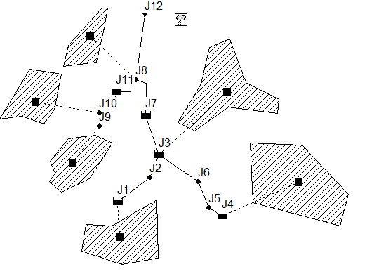
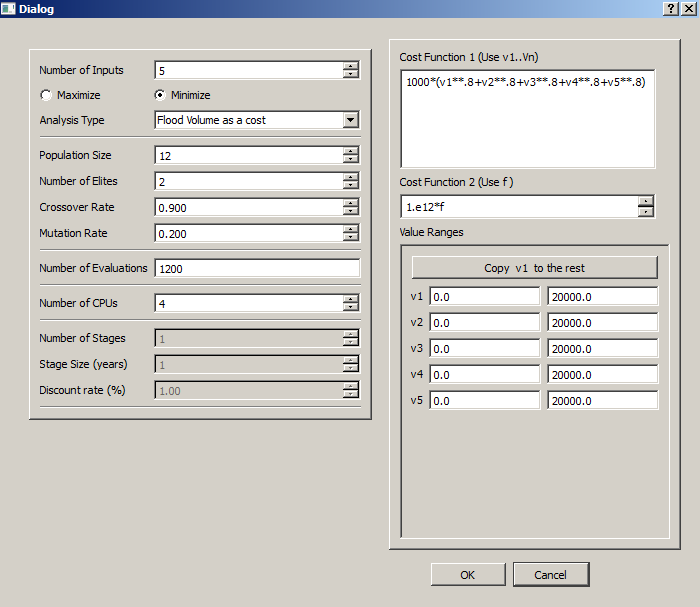
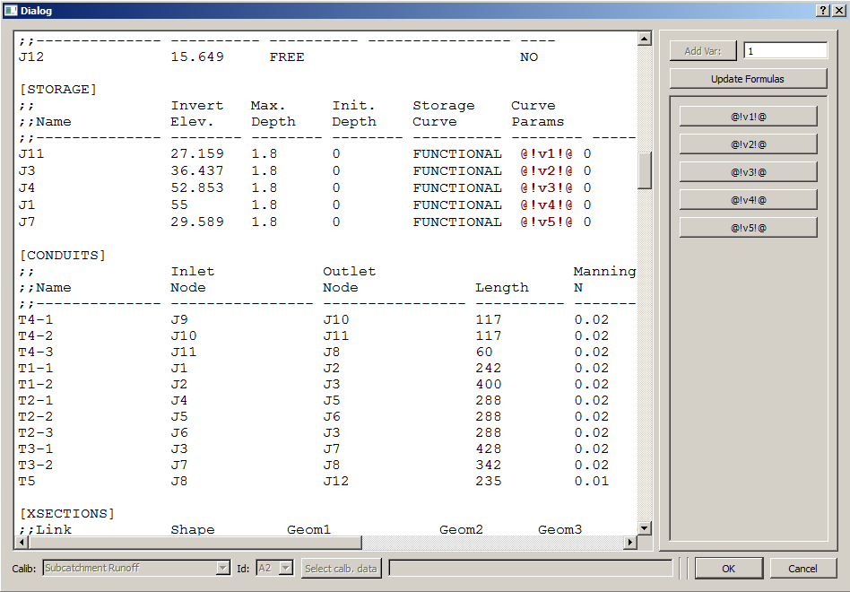
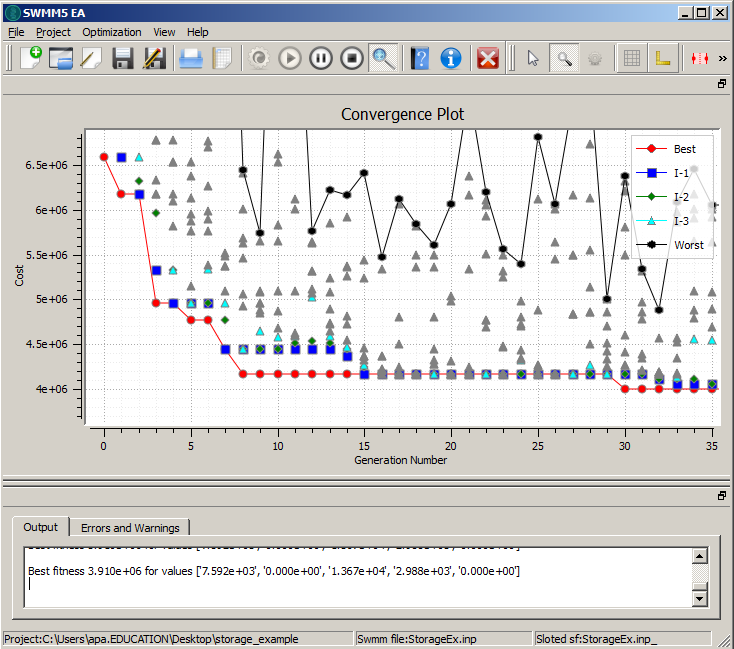

Example 1: Simple Optimization
==============================

   
   Network with five detention storages. 

Figure above shows the drainage network used in this example. It consists of six subcatchments, 
drained to the outlet ``J12`` by a dendritic drainage network. The network has five detention basins
(``J1``, ``J3``, ``J4``, ``J7`` and ``J11``). Each detention storage is ``1.8 m`` deep. 
We want to find the least-cost design that does not cause flooding [1]_.  The cost ``c1`` for construction of a detention basin of area ``a`` is simplified as: 

.. math::   

	c= 1000 a^{0.8}

We apply the constraint of not allowing for flooding by adding a penalty (cost) for flooding. 
We are not really interested in 
calculating 'cost' of flooding, rather we just want to make it high so that  the optimizer penalizes the 
solutions with flooding. For example we could use: 

.. math::
    c2= 1.0E12 f
	
Following figures show the Project parameters and swmm input file place-holders used in the example, 
respectively. 
	

	
   Project properties. 
	

	
   Place-holders for detention storage area. 
   
The figure below shows a part of the convergence plot. 

   
   Convergence plot. 
   
After 100 generations, the best solution has properties: 

============  ================ 
 Junction   	A(m\ :sup:`2`)    
============  ================   
J11       		  7592 
J3        		     0 
J4        		 13670
J1        		  2987 
J7        		     0  
============  ================

 
=================  ================
Constrction Cost          3.91 millons		    
=================  ================
=================  ================

======================== =========
System is not flooded. 		    
======================== =========
======================== =========

 
	
.. [1] For a design rainstorm lasting over a period of 2:00 hours, with 10 year return period. This rain storm is already built into the network model. 
