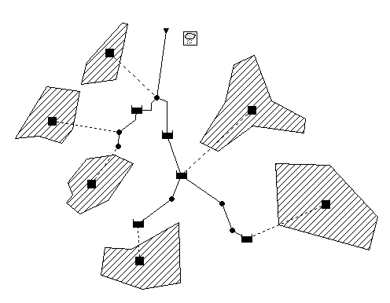
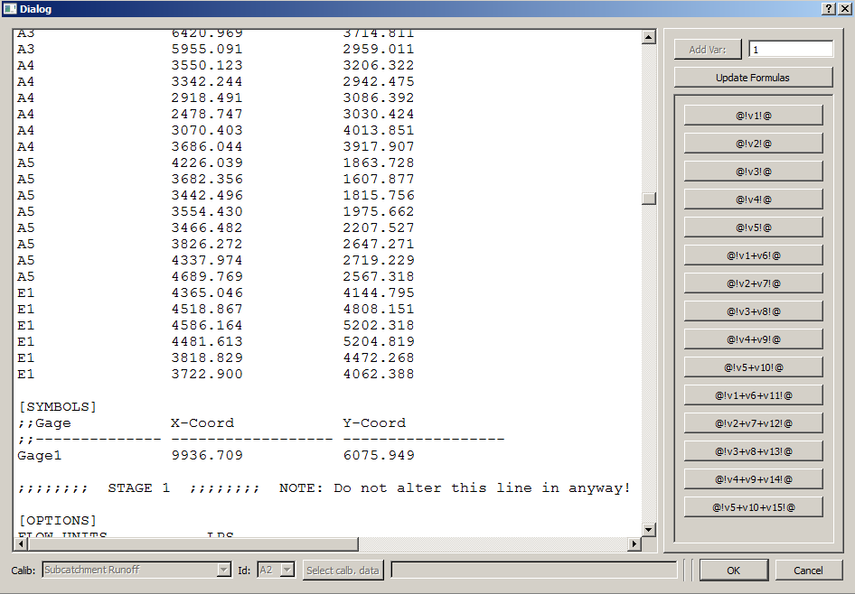
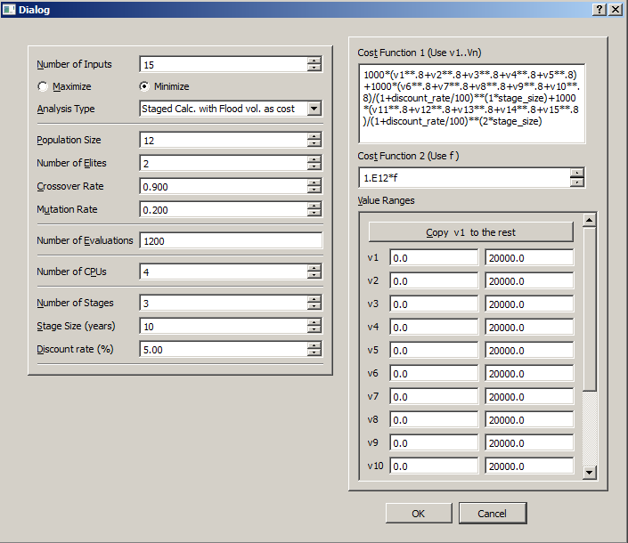
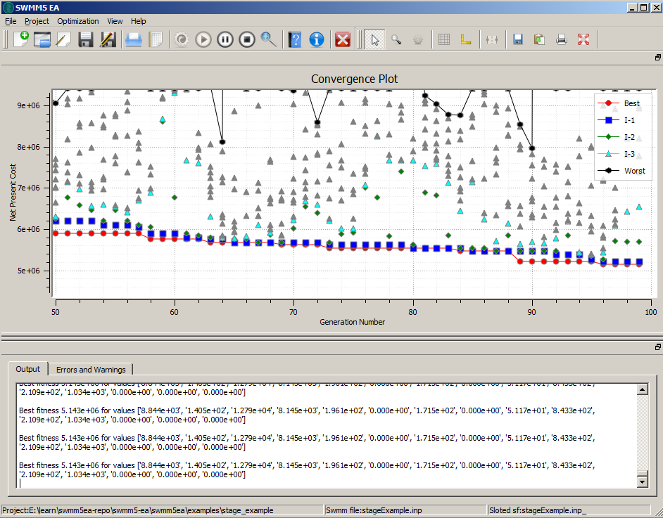

Example 3: Staged Optimization
============================== 

   
   Staged detention storage planning example. 

This example demonstrates the use of SWMM5-EA in staged-optimization problems. The problem goes like this: In order to mitigate flooding in a drainage network 
five detention storages are planned (The network and detention storage locations are exactly 
same as :ref:`Example 1<simple_example_label>`. The planning horizon in 30 years and planning should be done to be implemented in 3 stages (Stage 0: start of the project, Stage 1: 10 years into the future and Stage 2: 20 years into the future). The design goal is the least cost detention storage with no flooding for the design rainstorm given. It is estimated that the impervious fraction in each watershed will increase by 10% during each 10 year stage. For simplicity it is assumed that all other parameters remain same (e.g. no climate change!) [#]_. 

In staging problems, SWMM5-EA handles swmm input files in a very different way from other applications (e.g. Simple Optimization, Calibration). It duplicates the SWMM input file to :math:`n` copies (where :math:`n` is the number of stages). When the Insert Slots button is pressed (to edit place-holders), this process happens automatically and the place-holder dialog is filled with a compound file containing all these copies. Each swmm input file is separated by an entry similar to 

    ``;;;;;;;;  STAGE 2  ;;;;;;;;  NOTE: Do not alter this line in anyway! ;;;;;;;;;;;;;;;;;;;;`` 

   
   Place Holders in SWMM5 input file. This dialog presents a compound text file containing :math:`n` (:math:`=` number of stages) SWMM input files. SWMM input files are separated by a special entry: ``;;;;;;;;  STAGE 2  ;;;;;;;;  NOTE: Do not ...``

In the parameters pane, in addition to the usual ones, three new parameters are exposed: The number of stages, size of a stage and the discount rate. 

   
   Project parameters used.

Note that it is the responsibility of the user to introduce the `time value` concept 
when writing the cost function 1 (:math:`c_1`). The user can use any of the variables used in the left 
hand pane of the dialog when writing the equations. In this example, we have used the discount 
rate and stage size like this. Our cost formula is

.. math::
    \begin{array}{rl}
	c_1=&1000*(v1**.8+v2**.8+v3**.8+v4**.8+v5**.8) \\
	    &+1000*(v6**.8+v7**.8+v8**.8+v9**.8+v10**.8)/(1+\mbox {discount\_rate} /100)**(1*\mbox{stage\_size}) \\
		&+1000*(v11**.8+v12**.8+v13**.8+v14**.8+v15**.8)/(1+\mbox{discount\_rate}/100)**(2*\mbox{stage\_size})
    \end{array}
	
The cost function 2 (:math:`c_2`) remains simple. It is interpreted as `annual flood cost`.  
The SWMM5-EA system will calculate flood cost at each year using this user-provided formula, 
bring it to the present value and sums it all to calculate the net present cost of flooding. 

However, in this example (similar to :ref:`Example 1<simple_example_label>`,) we do no consider flood as a real cost 
but as a penalty. 
   

   
   After 100 generations. 

.. [#] The SWMM5-EA software allows implementing more complex problems where a number of parameters change. However, for this example we use a simple scenario. 
   
